---

# 🏗️ AWS DataSync + EFS + S3 Backup Automation (Terraform Project)

---

## 🚀 Project Overview

Many companies run their web servers on **EC2 instances** that generate important operational data.
However, collecting and backing up this data becomes challenging in **elastic environments**—instances scale up or terminate automatically based on workload.

This project demonstrates a scalable and automated solution using **Infrastructure as Code (Terraform)** and **AWS services** to ensure data durability, versioning, and event-driven notifications.

---


### 🏗️ **Project Architecture Overview**

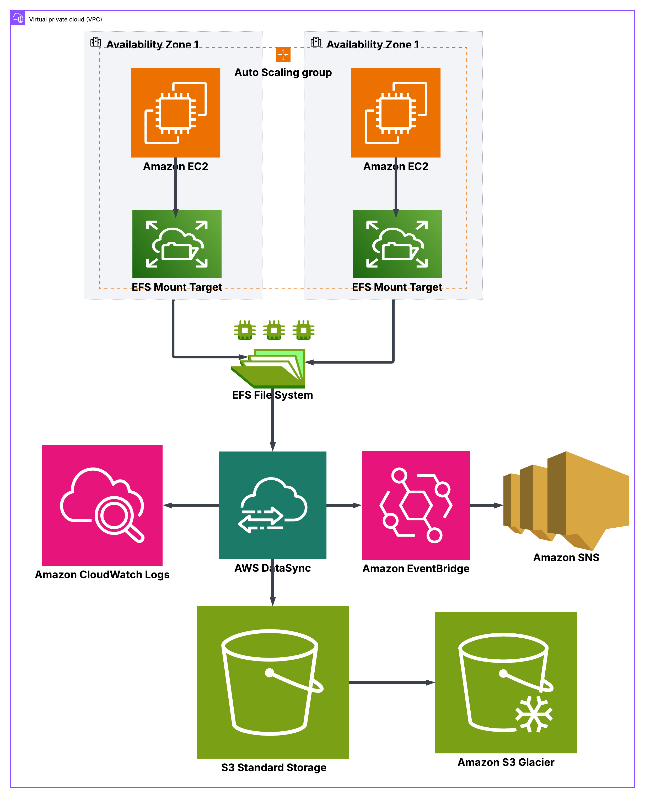  
*Figure 01 – System Architecture Overview: High-level view of the AWS backup pipeline showing EC2 instances using EFS, DataSync transferring data to a versioned S3 bucket, and EventBridge + SNS enabling monitoring and alerts.*

---

✅ **Explanation:**

* EC2 instances (inside an Auto Scaling Group) share files via **EFS**.
* **DataSync** transfers EFS data periodically to **S3** for archiving.
* **S3** uses **versioning and lifecycle rules** to retain data and transition old versions to **Glacier**.
* **CloudWatch Logs** capture DataSync task activity for debugging.
* **EventBridge** listens for DataSync execution state changes and triggers **SNS** notifications (email alerts).

---

### 🧰 **Prerequisites**

Before deploying this project, ensure you have the following:

1. **AWS CLI** installed and configured with appropriate credentials

   * Verify installation with:

     ```bash
     aws --version
     aws sts get-caller-identity
     ```
2. **Terraform CLI** installed (v1.5+ recommended)

   * Verify installation with:

     ```bash
     terraform -version
     ```
3. **Basic knowledge of AWS Cloud**, especially:

   * VPCs, subnets, and security groups
   * EC2 instances and Auto Scaling Groups
   * EFS, S3, and DataSync
   * CloudWatch and SNS
4. **IAM user or role** with sufficient permissions to create:

   * VPC, EC2, EFS, S3, DataSync, CloudWatch, and SNS resources
5. **Text editor** such as VS Code, Sublime Text, etc for editing Terraform configurations


---


## 🧩 Architecture Phases

### 1️⃣ Infrastructure Backbone (VPC | Subnets | Security Groups | EFS)

I began by setting up the foundational network infrastructure:

* **VPC**, **public/private subnets**, **Internet Gateway**, and **security groups**.
* Leveraged **Terraform public modules** to save time—only needed to read documentation, define attributes, and declare outputs.
* This modular approach ensured reusability and avoided reinventing existing solutions.

**Key Snippet:**
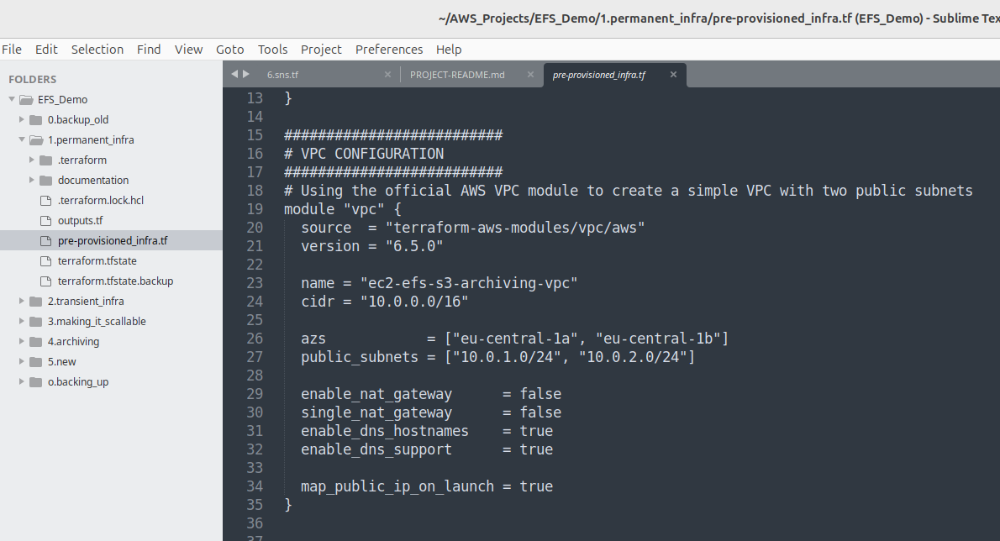
*Figure 2: Terraform VPC configuration showing use of AWS official VPC module with public subnets and DNS support.*

---

### 2️⃣ EFS Auto-Mount Testing

Using the **terraform_remote_state** data source, I imported outputs from the backbone layer, avoiding redundant resource creation.
In real deployments, these base resources already exist before application layers are applied.

Steps:

1. Configured **EC2 instances** to automatically mount **EFS** on startup.
2. Verified via system logs and listing contents under `/mnt/efs`.
3. Ensured persistence using `/etc/fstab` or EC2 user-data scripts.

While manual mounting was easy, **automating it introduced inconsistency**—some instances mounted successfully, others failed.

**Troubleshooting:**

* Reviewed `/var/log/cloud-init.log` to identify timing/race issues.
* Converted mounting logic into a **template file** variable for easier updates.
* Fixed Terraform user-data errors by **base64-encoding** the script before passing it to EC2 launch templates.

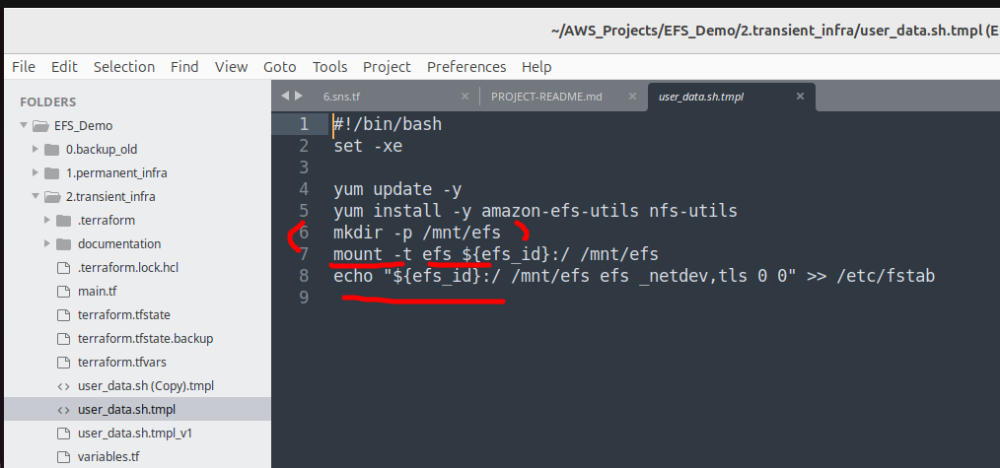
*Figure 03 : A screenshot of the bash script passed as a user data*
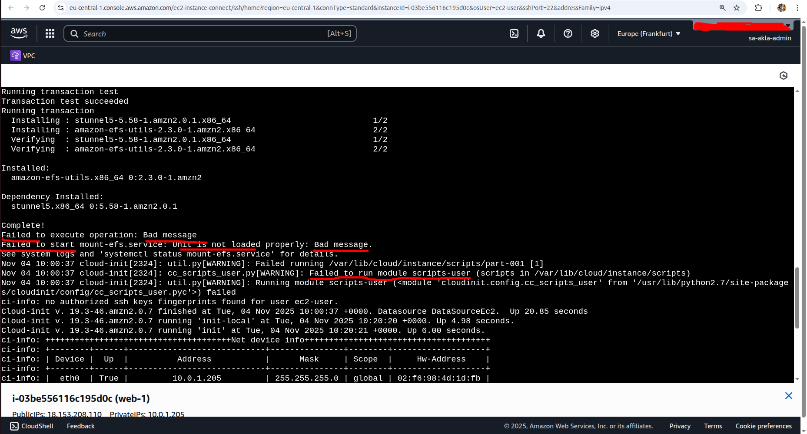
*Figure 04: A screenshot of `/var/log/cloud-init.log` giving information about efs mounting failure*

---

### 3️⃣ Auto-Scaling Group (ASG) Integration

After confirming automatic EFS mounting worked, I introduced **Auto Scaling Groups** for elasticity.

* Implemented a **target-tracking policy** based on **CPU utilization**.
* Installed CPU-stress utilities to simulate load.
* Verified that new EC2 instances scaled out automatically and all instances correctly mounted the shared EFS.

Result: All EC2s accessed the same shared data, and data persisted even after instance termination.


*Figure 05: A screenshot showing the number of EC2 instances BEFORE CPU Utilization simulation with cpu-stress*

*Figure 06: A screenshot showing the number of EC2 instances launched in response to cpu-stress*

---

### 4️⃣ Refactoring and Modularization

Before introducing data archiving, I reorganized the Terraform codebase into **modules** to improve maintainability and speed up deployments.
This separation of layers (network, compute, storage, backup) mirrors best-practice enterprise architectures.

---

### 5️⃣ S3 Versioning & Lifecycle Management

Created an **S3 bucket** to serve as the archival target:

* Enabled **versioning** for object history.
* Configured **lifecycle rules** to automatically transition older data to **Glacier Deep Archive**.
* Verified bucket policies and encryption defaults.

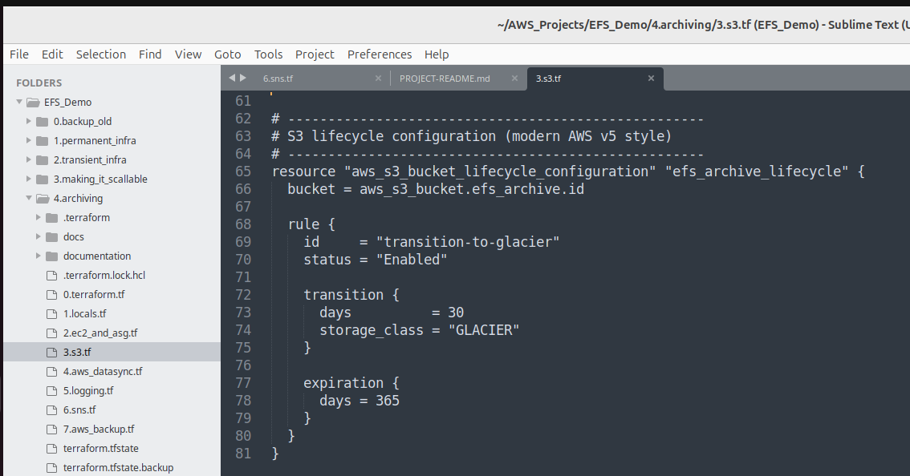
*Figure 07 Screenshot of S3 bucket versioning and Lifecycle rules*

---

### 6️⃣ AWS DataSync Configuration

Configured **AWS DataSync** for scheduled synchronization between EFS (source) and S3 (destination).

**Initial Challenge:**
Terraform-provisioned tasks failed with:

> “Unable to connect to S3 endpoint.”

**Diagnosis & Solution:**

* Enabled **CloudWatch logging**, but logs lacked detail.
* Re-created the task manually in the console → successful execution.
* Compared configurations → discovered missing HTTPS (443) inbound rule and insufficient IAM permissions.

✅ **Fix:** Updated the **security group to allow inbound 443 traffic from within the VPC** to permit secure internal communication among EFS, DataSync, and S3 endpoints.

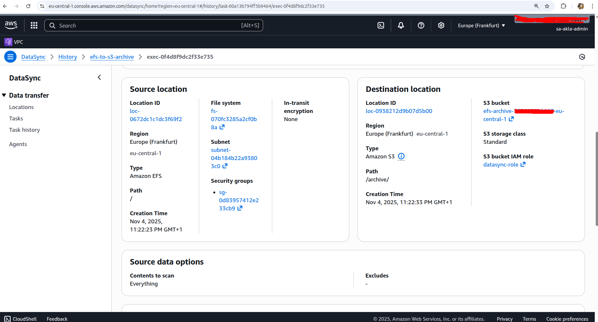
*Figure 08 : A screenshot of AWS Console Output of Datasync Task showing Source and Destination details*
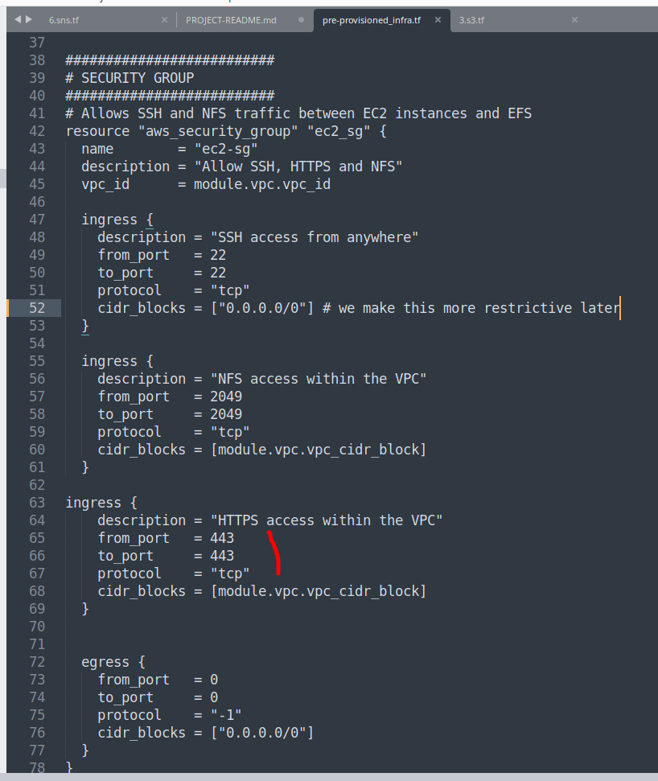
*Figure 9: A Screenshot showing the uppdated Security Group Rule*

**Testing Scenarios:**

a. **No new data** on EFS → DataSync ran with 0 transfers (✅ expected).
b. **Modified data** → DataSync transferred changes successfully.
c. Verified data appeared in S3 and versioning captured updates.


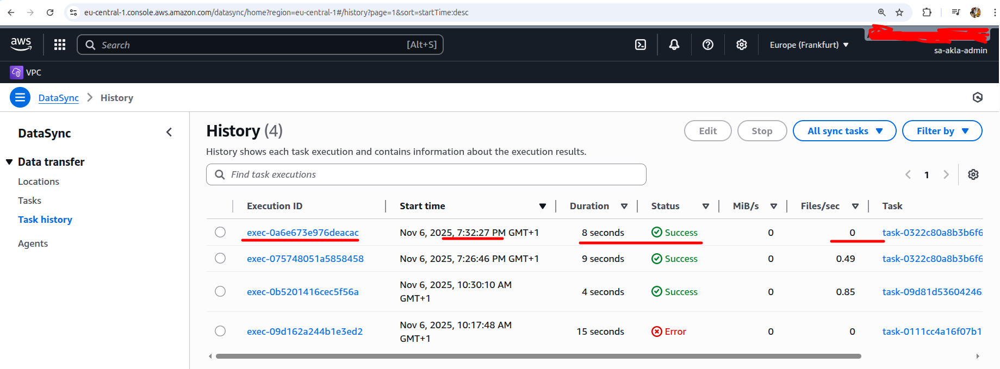
*Figure 10: A screenshot of the datasync task output showing no transfer when there is no change of data on the EFS*
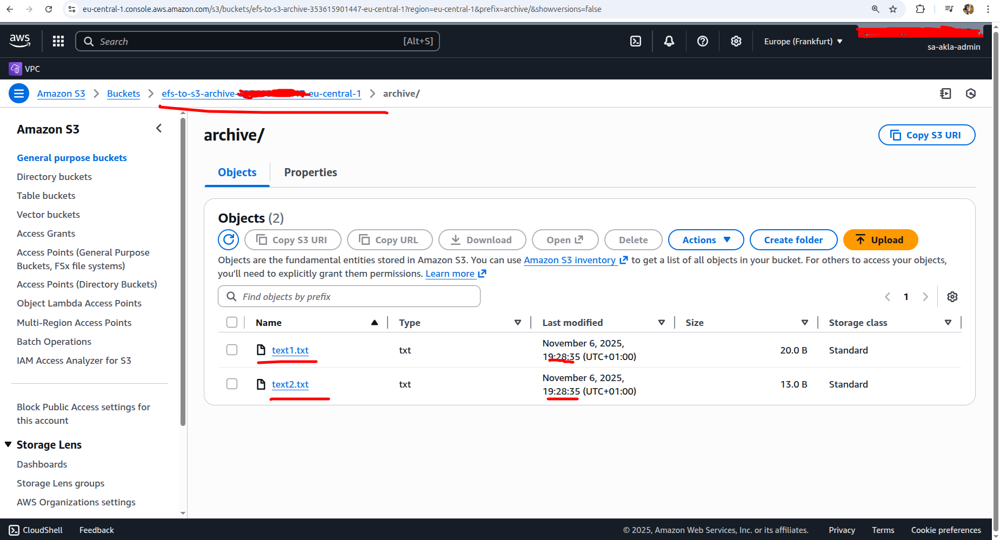
*Figure 11: A screenshot showing that the objects on the s3 bucket remains unchanged*

*Figure 12: A screenshot showing Changing `text2.txt` on EFS*
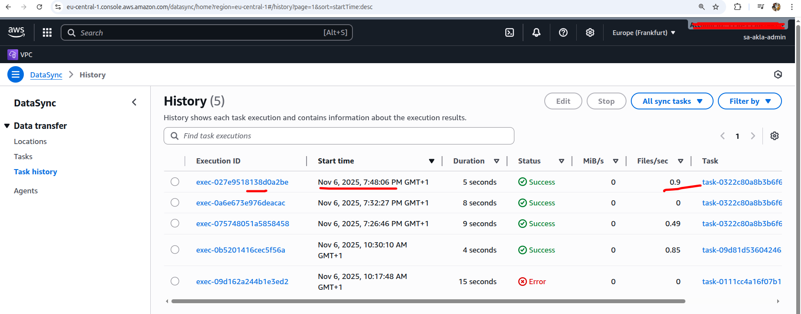
*Figure 13: A screenshot showing Datasync has transfered data because there is a change*

*Figure 14: A screenshot showing that the changed file has been uploaded to the s3 bucket*


A similar results was obtained when file or data was added to the efs, showing that datasynch was working as expected.


---

### 7️⃣ Email Alert & Monitoring with SNS + EventBridge

To receive alerts on DataSync task status (success/failure):

1. **Created SNS topic**: `datasync-task-notifications`
2. **Added email subscription** and confirmed via email link.
3. **Configured CloudWatch EventBridge rule** with pattern:

```json
{
  "source": ["aws.datasync"],
  "detail-type": ["DataSync Task Execution State Change"]
}
```

4. **Defined target** → SNS topic.
5. Added **permissions** allowing EventBridge to publish to SNS.

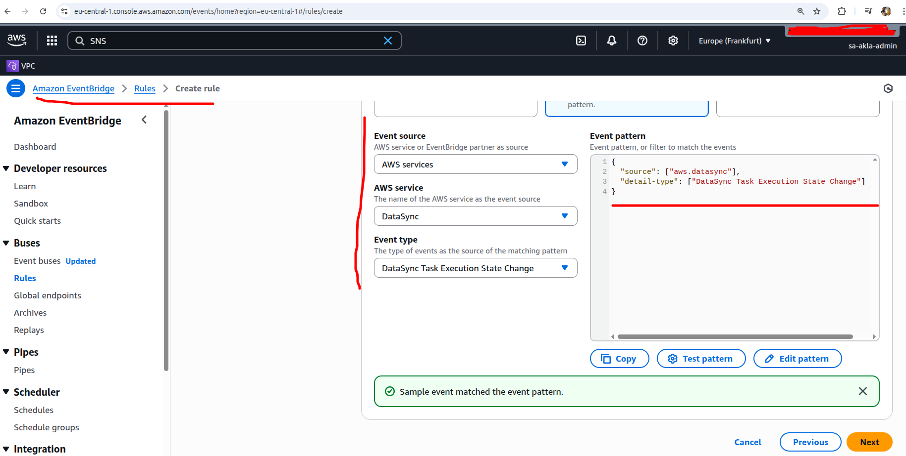
*Figure 15: A screenshot showing Event Pattern Testing on EventBridge*
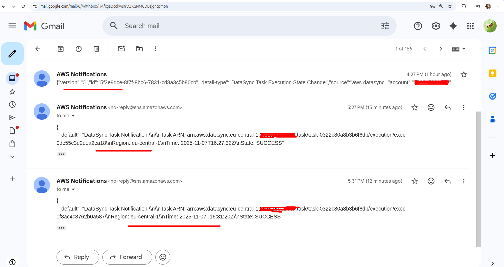
*Figure 16: A screenshot of the Email alert received*

---

#### 🔍 SNS Troubleshooting Checklist

1. Confirm the subscription email was approved and also verify that the correct **Topic ARN** is used in EventBridge target.
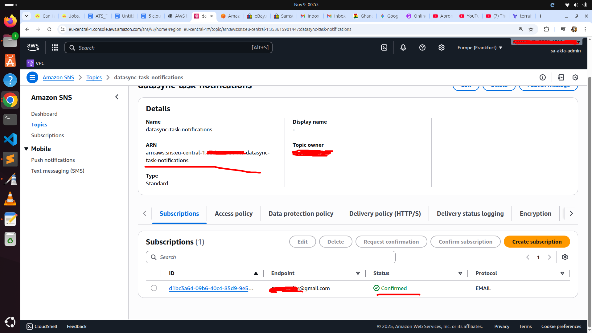
*Figure 17: A screenshot showing email confirmation and Topic ARN*


2. Manually publish a test message:

```bash
aws sns publish \
  --region eu-central-1 \
  --topic-arn arn:aws:sns:OPERATING_REGION:YOUR_ACCOUNT_ID:datasync-task-notifications \
  --message "Test DataSync alert message"
```

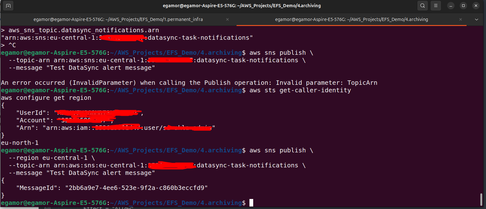
*Figure 18: A screenshot of troubleshooting SNS related issues*
4. If manual test works but automatic alert fails → re-examine the **event pattern** and **detail-type**.

---

## 📈 Summary of Achievements

* Built complete AWS infrastructure (VPC, EFS, EC2, ASG) with Terraform.
* Automated EFS mounting across scalable EC2 fleet.
* Implemented versioned S3 archiving via DataSync and lifecycle policies.
* Added email alerting and logging for DataSync status tracking.
* Practiced IaC principles with modular Terraform design for reusability and clarity.

---

## 🧠 Business Impact

* **Data Durability & Resilience:** Ensures critical data persists even as EC2s scale in/out.
* **Operational Efficiency:** Automated data transfer and archiving reduce manual oversight.
* **Security & Compliance:** Uses private VPC flows and encrypted HTTPS (443) traffic only within AWS.
* **Cost Optimization:** Lifecycle rules and Glacier storage minimize long-term costs.
* **Real-time Visibility:** SNS alerts and CloudWatch logs enable fast troubleshooting.

---

## 🧩 Optional Enhancement – AWS Backup Integration

For system-level protection, integrate **AWS Backup** to snapshot EFS volumes, EC2s, and databases.
Snapshots capture full system state for point-in-time recovery.
This complements (but doesn’t replace) DataSync’s file-level archiving.

Our pipeline focuses on **critical file and data archival**, not full system imaging.
If full system backup is required, **AWS Backup** is a better fit.

---

✅ **End of Report**
*Prepared as part of an AWS Infrastructure Automation and Data Archiving project using Terraform.*

---
A git the full code can be found at: